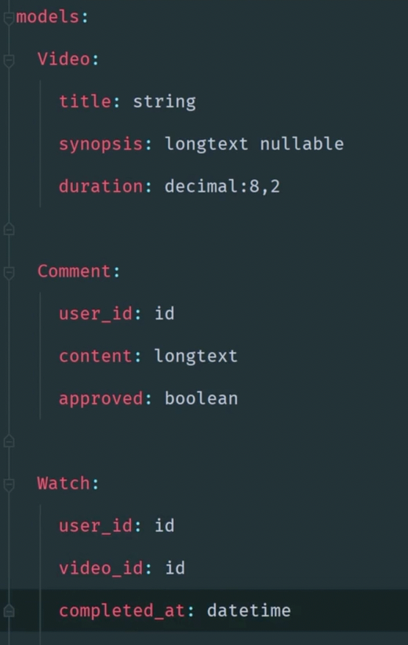

# Day 3

It's my day off today - so let's continue to read the doc :)
I'm at the [Controllers](https://laravel.com/docs/10.x/controllers) section of the doc

I'm also looking at the community (Twitter, Reddit, Discord, Larachat, etc.) to see what people are talking about and
gather experiences .

I'd like to know what is it to work on a laravel project in a company. The tech seems nice for small stuff but how does
it looks for bigger projects?

### Interesting reading from Twitter

Someone speak about php artisan blueprint:build

- What is that? Code generation from a draft file
- Is it useful? Look like if we start a project from scratch, it could be useful to generate the first draft of the
  code.

It looks great when you know already how to develop a Laravel App.
At the same time, even if you don't know how to ... it create a lot of "best practice" stuff.

It looks quite old also why it's not a bigger thing ?

The doc link : https://blueprint.laravelshift.com/docs/getting-started/
